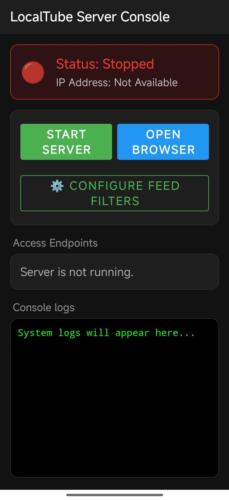
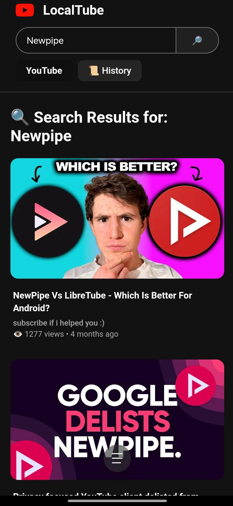
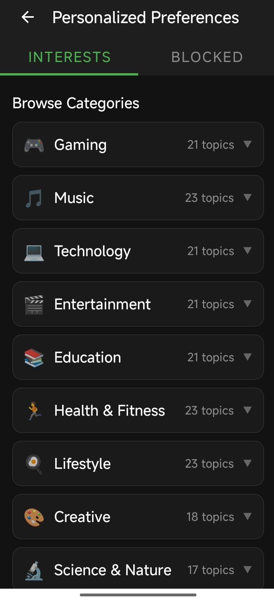

# LocalTube (NewPipe Extractor)

[](https://github.com/TeamNewPipe/NewPipeExtractor/actions/workflows/ci.yml) [](https://jitpack.io/#teamnewpipe/NewPipeExtractor) [JDoc](https://teamnewpipe.github.io/NewPipeExtractor/javadoc/) • [Documentation](https://teamnewpipe.github.io/documentation/)

**LocalTube** is a fork of [NewPipe Extractor](https://github.com/TeamNewPipe/NewPipeExtractor) that bundles a self-hosted local HTTP server Android application (`localServerApp`). It allows you to host, browse, search, and stream content from streaming platforms directly from any device in your local network using a standard web browser.

## 📺 LocalTube Application (`localServerApp`)

**LocalTube** transforms the stateless `NewPipeExtractor` library into a private, self-hosted streaming web server.

### 🌟 Key Features

- **Decentralized Local Server**: Runs a lightweight, concurrent Java HTTP server on your Android device (default port `8080`), serving a modern, responsive web interface.
- **Cross-Device Playback**: Connect to the server from any device on your local Wi-Fi network (PC, laptop, smart TV, tablet) by visiting the local IP (e.g., `http://192.168.1.100:8080`).
- **Private Watch History**: Keeps track of your watched videos locally on the device using a secure SQLite database (`HistoryDbHelper`) without external telemetry or tracking.
- **HTML5 Player & Stream Proxying**: Proxies video/audio streams through the local server to bypass client-side signature/throttling restrictions, supporting range headers (seeking/fast-forwarding) directly inside native browser HTML5 elements.
- **Multi-Service Ready**: Leveraging the extractor core, it is designed to support extraction across YouTube, SoundCloud, PeerTube, Bandcamp, and media.ccc.de.

### 🛠️ Build and Run

To compile and launch the local server app:

1. **Build and install** the application on your Android device/emulator:
   ```bash
   ./gradlew :localServerApp:installDebug
   ```
   *(Or open the repository in Android Studio and run the `:localServerApp` module).*
2. **Open the LocalTube App** on your device.
3. Tap **Start Server** to spin up the background service (runs as a foreground service with a notification displaying your network URL).
4. Connect to `http://localhost:8080` (or `http://<your-device-ip>:8080`) from any browser on the same network to start streaming!

### 📸 Screenshots

| Android App Interface | Web Interface Home | Personalized recommendations |
|:---:|:---:|:---:|
|  |  |  |

---

## 📦 Extractor Library Usage

NewPipe Extractor is available at JitPack's Maven repo.

If you're using Gradle, you could add NewPipe Extractor as a dependency with the following steps:

1. Add `maven { url 'https://jitpack.io' }` to the `repositories` in your `build.gradle`.
2. Add `implementation 'com.github.teamnewpipe:NewPipeExtractor:INSERT_VERSION_HERE'` to the `dependencies` in your `build.gradle`. Replace `INSERT_VERSION_HERE` with the [latest release](https://github.com/TeamNewPipe/NewPipeExtractor/releases/latest).
3. If you are using tools to minimize your project, make sure to keep the files below, by e.g. adding the following lines to your proguard file:
 ```
## Rules for NewPipeExtractor
-keep class org.mozilla.javascript.** { *; }
-keep class org.mozilla.classfile.ClassFileWriter
-dontwarn org.mozilla.javascript.tools.**
```

> [!NOTE]
> To use NewPipe Extractor in Android projects with a `minSdk` below 33, [core library desugaring](https://developer.android.com/studio/write/java8-support#library-desugaring) with the `desugar_jdk_libs_nio` artifact is required.

### Testing changes

#### Maven Central

NewPipe Extractor's snapshots are available on Maven Central's snapshot repository. These versions
are based on the commit's short hash (for e.g. `git rev-parse --short HEAD`) and are available for
90 days since the date of publication/commit.

```kotlin
repositories {
    maven(url = "https://central.sonatype.com/repository/maven-snapshots/")
}

dependencies {
    implementation("net.newpipe:extractor:${LAST_COMMIT_SHORT_HASH}-SNAPSHOT")
}
```

#### Local

To test changes quickly you can build the library locally. A good approach would be to add something like the following to your `settings.gradle`:

```groovy
includeBuild('../NewPipeExtractor') {
    dependencySubstitution {
        substitute module('com.github.teamnewpipe:NewPipeExtractor') with project(':extractor')
    }
}
```

Another approach would be to use the local Maven repository, here's a gist of how to use it:

1. Add `mavenLocal()` in your project `repositories` list (usually as the first entry to give priority above the others).
2. It's _recommended_ that you change the `version` of this library (e.g. `LOCAL_SNAPSHOT`).
3. Run gradle's `ìnstall` task to deploy this library to your local repository (using the wrapper, present in the root of this project: `./gradlew install`)
4. Change the dependency version used in your project to match the one you chose in step 2 (`implementation 'com.github.teamnewpipe:NewPipeExtractor:LOCAL_SNAPSHOT'`)


> [!TIP]
> Tip for Android Studio users: After you make changes and run the `install` task, use the menu option `File → "Sync with File System"` to refresh the library in your project.

## Supported sites

The following sites are currently supported:

- YouTube
- SoundCloud
- media.ccc.de
- PeerTube (no P2P)
- Bandcamp

## License

[](https://www.gnu.org/licenses/gpl-3.0.en.html)  

NewPipe Extractor is Free Software: You can use, study share and improve it at your
will. Specifically you can redistribute and/or modify it under the terms of the
[GNU General Public License](https://www.gnu.org/licenses/gpl.html) as
published by the Free Software Foundation, either version 3 of the License, or
(at your option) any later version.  
