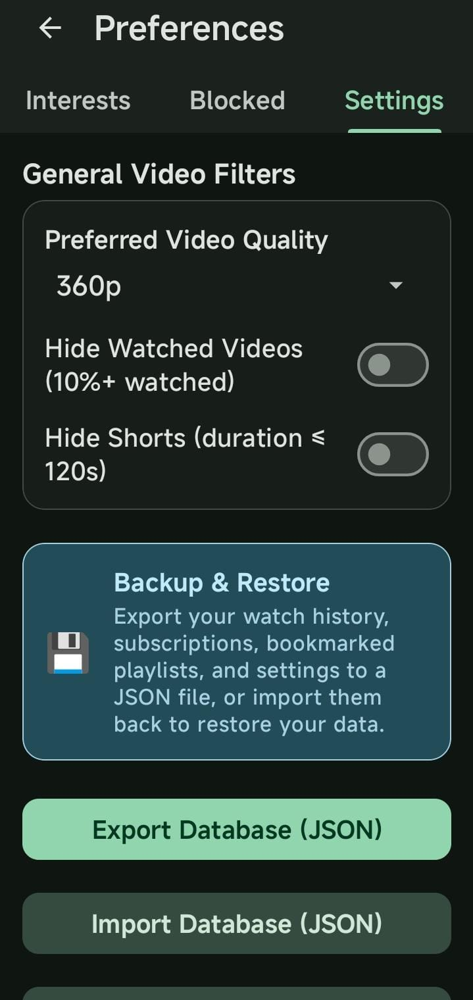
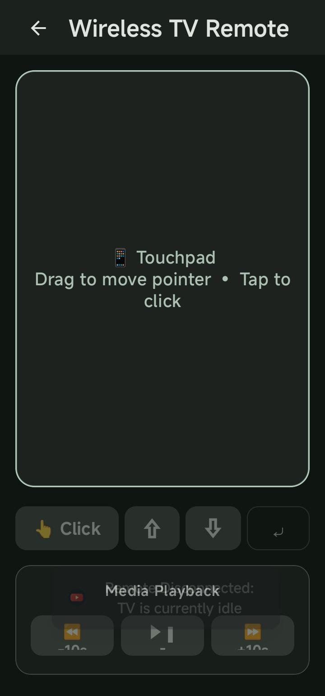
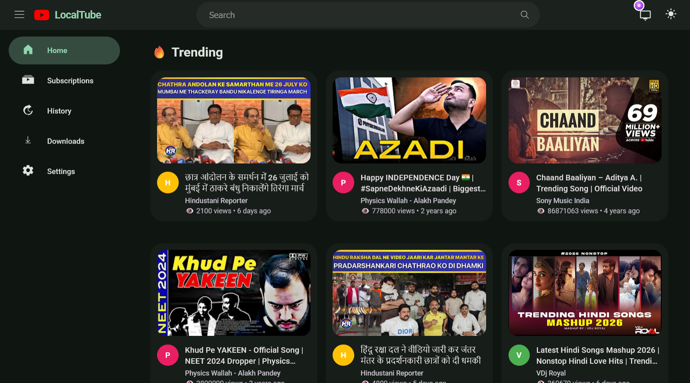
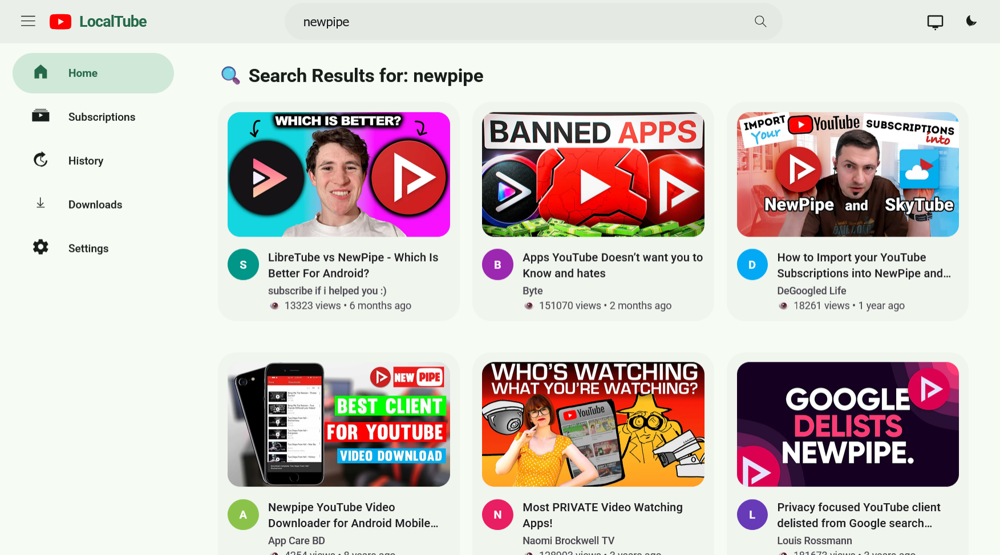
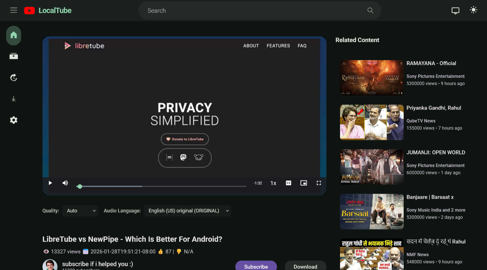
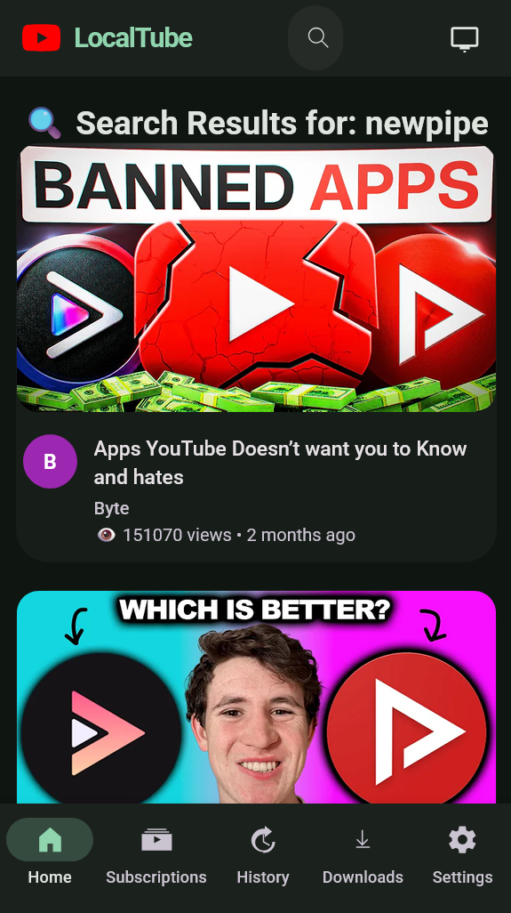
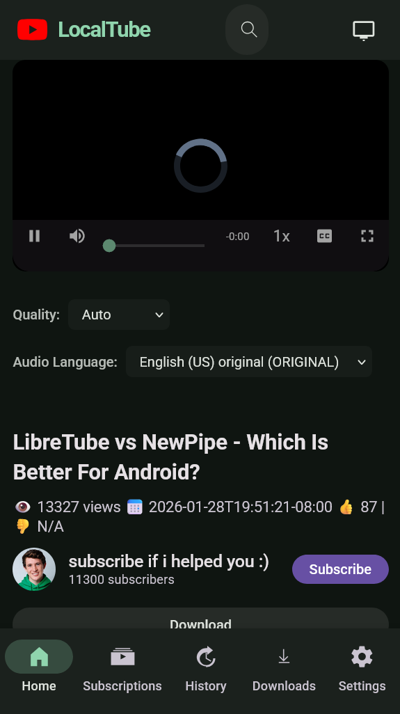

# LocalTube

[](https://www.gnu.org/licenses/gpl-3.0)

**LocalTube** is a high-performance, self-hosted streaming server solution built exclusively for **YouTube**. By bundling a lightweight, concurrent Java HTTP server inside an Android application (`localServerApp`), LocalTube enables you to browse, search, and stream YouTube videos and Shorts directly from any device in your local network using a standard web browser—with absolute privacy.

---

## 📺 LocalTube Application (`localServerApp`)

LocalTube transforms your Android device into a private, self-hosted YouTube streaming web server.

### 🌟 Key Features
- **Decentralized Local Server:** Runs a lightweight, concurrent Java HTTP server directly on your Android device (default port `8080`), serving a modern, responsive web interface.
- **Cross-Device Playback:** Connect seamlessly to the server from any device on your local network (Smart TV, PC, laptop, tablet) by visiting your device's local IP (e.g., `http://192.168.1.100:8080`).
- **Video.js Media Player Integration:** High-performance, customizable HTML5 media player using Video.js for responsive playback controls, adaptive quality switching, and speed adjustment.
- **Dedicated Vertical Shorts Player**: Experience YouTube Shorts in a customized vertical scrollable player, featuring full swipe gesture support.
- **Smart Link Routing**: Automatically routes Shorts clicked from Watch Later, History, or Search feeds straight to the dedicated Shorts player, loading the selected video first.
- **YouTube Interests Importer**: Securely log into YouTube via WebView to scrape homepage recommended videos and automatically extract unique tags to build a personalized feed interests keyword list.
- **Cross-Device Remote Control:** Control active playback clients on your local network (play, pause, seek) directly from the server interface.
- **Database Backup (Import/Export):** Export and restore your SQLite database settings, personalized interests, and watch history as simple JSON backups.
- **Private Watch History & Settings:** Tracks your watch history locally using a secure SQLite database (`HistoryDbHelper`), maintaining absolute privacy with zero external tracking, ads, or telemetry.

---

## 📸 Interface Preview

### Android Application
| Server Control (Main) | Server Settings | Touchpad Remote |
| :---: | :---: | :---: |
|  |  |  |

### Web Interface (Desktop & TV)
| Home (Dark Theme) | Home (Light Theme) | Web Player & Details |
| :---: | :---: | :---: |
|  |  |  |

### Web Interface (Mobile)
| Mobile Web Home | Mobile Web Player |
| :---: | :---: |
|  |  |

---

## 🛠️ Build and Installation

To compile and launch the local server application:

1. **Build and install** the application on your Android device:
   ```bash
   ./gradlew :localServerApp:installDebug
   ```
   *Alternatively, open this repository in Android Studio and run the `:localServerApp` run configuration.*

2. **Run the Server:**
   - Open the **LocalTube** app on your device.
   - Tap **Start Server** to activate the foreground service. A persistent notification will display your active local network URL.
   - Access `http://localhost:8080` (or `http://<your-device-ip>:8080`) from any browser on the same network.

---

## 🌐 Supported Platforms
This project is dedicated exclusively to:
- **YouTube** (Videos, Shorts, and Subscriptions)

---

## 📄 License
This project is licensed under the **GNU General Public License v3.0**. See the [LICENSE](LICENSE) file for details.

---

## Support the Project

If you would like to support the developer:

[](https://paypal.me/diekaiju)
