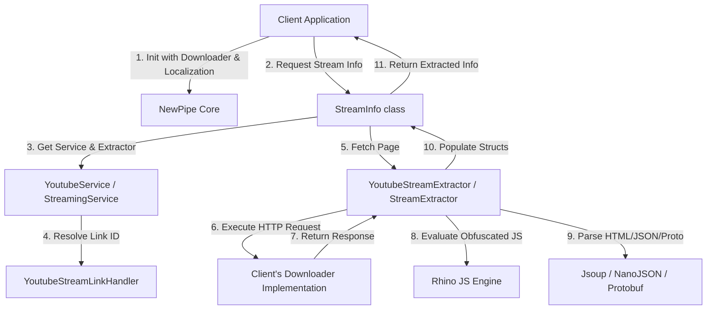

# NewPipe Extractor Knowledge Base

This document provides a comprehensive overview of the `NewPipeExtractor` project. It is designed to enable developers, AI assistants, or autonomous agents to fully understand, maintain, extend, debug, and contribute to the codebase without requiring additional context.

---

# PROJECT OVERVIEW

* **Project Name**: NewPipe Extractor
* **Purpose**: A stateless Java/Kotlin library designed to scrape and extract media stream URLs and metadata (title, views, description, comments, etc.) from various public streaming websites without relying on official, proprietary APIs or SDKs.
* **Core Problem Solved**: Streaming platforms (such as YouTube and SoundCloud) frequently update their web interfaces, deprecate public APIs, obfuscate media URLs, throttle download speeds, or require complex device integrity checks. NewPipe Extractor isolates all website-scraping, JS-deciphering, Protobuf-decryption, and parameter-obfuscation logic into a clean, reusable Java library. This shields media players and user interfaces from constant upstream API breakage.
* **Target Users**: Developers building privacy-respecting, alternative media streaming clients (primarily Android and desktop Java/Kotlin applications, such as the NewPipe Android app or NewPipe CLI and desktop ports).
* **Main Capabilities**:
  * **Multi-Platform Scraping**: Supports YouTube, SoundCloud, PeerTube, Bandcamp, and media.ccc.de.
  * **Direct Stream Resolution**: Resolves direct URLs for progressive streams, HLS manifests, and DASH MPD manifests (both video and audio tracks).
  * **YouTube Deciphering**: Extracts and evaluates YouTube player JavaScript to decipher signatures and n-parameter throttling.
  * **Integrity Bypass**: Integrates with caller-provided Proof of Origin Tokens (`poToken`) to circumvent YouTube blocks.
  * **Rich Metadata Collection**: Extracts related content lists, search results, search suggestions, comments, playlists, channels (with tabs), and kiosks (Trending, Live, Music, Gaming, Podcasts).
  * **Robust Localization**: Employs a relative date parser that converts localized strings (e.g., "il y a 2 ans", "3 days ago") into standard date-time formats across dozens of locales.
* **Current Development Status**: Stable and actively maintained. It is the core library driving the production NewPipe Android application.

---

# HIGH-LEVEL ARCHITECTURE

## System Overview
NewPipe Extractor is a stateless, synchronous Java library. It does not run background threads, event loops, or local databases. Instead, it operates on a pull-based model: the caller supplies an HTTP client implementation (`Downloader`), initiates extraction by passing a URL, and retrieves structured data models (`Info`).



## Major Components
1. **NewPipe (Core Entry Point)**: Manages global initialization, preferred localization, and content country settings, as well as the active `Downloader` registry.
2. **StreamingService (Service Registry)**: Abstract base representing a target platform (e.g., `YoutubeService`). Acts as a factory creating link handlers, search query handlers, and extractors.
3. **LinkHandler & LinkHandlerFactory**: Clean, canonicalize, and validate incoming URLs. They parse URLs to isolate the platform's native identifier (e.g., video ID `RER5qCTzZ7`).
4. **Extractor**: Stateful parser lifecycle. Callers execute `fetchPage(downloader)`, which downloads the web document or API response and parses it. Extractor subclasses are specialized by service and content type (e.g., `YoutubeStreamExtractor`).
5. **Downloader**: Interface defining HTTP GET/POST/HEAD operations. Binds the stateless library to the calling application's networking stack.
6. **Info & InfoItem**: 
   * `Info`: Root data model for an extracted resource (e.g., `StreamInfo`, `ChannelInfo`).
   * `InfoItem`: Simplified, list-level item representations (e.g., `StreamInfoItem` for related videos or search items) collected via `InfoItemsCollector`.

## Data Flow
1. **Registration**: The caller implements the `Downloader` interface (e.g., wrapping OkHttp) and registers it via `NewPipe.init(downloader, localization, contentCountry)`.
2. **URL Matching**: The caller queries the registry using `NewPipe.getServiceByUrl(url)` to get the corresponding `StreamingService`.
3. **Link Handler Creation**: The service's `LinkHandlerFactory` is invoked to clean the URL and extract the query/stream ID.
4. **Extractor Lifecycle**: The service generates the appropriate `StreamExtractor` (or comments/playlist/channel extractor). The caller triggers `extractor.fetchPage()`.
5. **HTTP Callback**: The extractor issues one or more HTTP requests through the registered `Downloader`.
6. **Parsing and Extraction**: The extractor processes the payload. It extracts metadata and direct stream links, and delegates JS execution to the Rhino engine for decryption.
7. **Mapping to Info**: The helper class (e.g., `StreamInfo.getInfo(extractor)`) maps raw parsed fields into the final immutable `Info` model returned to the client.

## Architectural Decisions and Reasoning
* **Decoupled Downloader**: By excluding an HTTP client implementation, the library remains lightweight and compatible across Java SE environments, desktop runtimes, and various Android versions without causing classloader conflicts.
* **Mozilla Rhino JS Engine**: YouTube obfuscates signatures and n-parameters via dynamic JS code. Rather than transcribing this changing logic into Java (which breaks frequently), the library downloads YouTube’s player JavaScript and executes the deobfuscation function inside Rhino's sandboxed interpreter.
* **Lite Protobuf & Nanojson**: Dependencies are optimized for file size and parsing performance. Protobuf Lite is used to minimize binary size for Android apps, and the custom `nanojson` fork reduces memory allocations.

---

# TECHNOLOGY STACK

* **Language**: Java 11 (source and target compatibility set to Java 11).
* **HTML Parsing**: **Jsoup** (used to query DOM hierarchies, parse microdata, and extract embedded JSON scripts).
* **JSON Parsing**: 
  * **Nanojson** (TeamNewPipe fork): Optimized, lightweight, and allocation-friendly parser used in the extraction core.
  * **Gson** (Google): Used exclusively in the JUnit testing suite for test configurations.
* **Protobuf**: **Google Protobuf Java Lite** (used to generate InnerTube API payloads for YouTube).
* **JavaScript Evaluation**: **Mozilla Rhino Core & Engine** (configured in interpreted mode to execute YouTube deobfuscation routines safely).
* **Build System**: **Gradle** with Kotlin DSL (`build.gradle.kts`) and version catalogs (`gradle/libs.versions.toml`).
* **Unit Testing**: **JUnit Jupiter 5** (JUnit BOM, platform launcher, and engine).

---

# DIRECTORY STRUCTURE

```
NewPipeExtractor/
├── checkstyle/               # XML rules for Checkstyle static analysis
├── gradle/                   # Gradle wrapper and libs.versions.toml version catalog
├── timeago-generator/        # Compile-time tool converting raw translation JSONs to Java classes
├── timeago-parser/           # Project module hosting generated date-parsing regex maps
│   ├── raw/                  # Translation JSON templates
│   └── src/main/java/...     # Date pattern holder classes
└── extractor/                # Core NewPipe Extractor source code
    ├── src/main/proto/       # Protobuf files representing InnerTube request payloads
    ├── src/main/java/org/schabi/newpipe/extractor/
    │   ├── downloader/       # Downloader, Request, and Response interface models
    │   ├── exceptions/       # Domain-specific scrapers exceptions (e.g., ReCaptchaException)
    │   ├── linkhandler/      # URL sanitizers and ID extractors
    │   ├── localization/     # Locales, ContentCountry, and TimeAgoParser wrapper
    │   ├── services/         # Site-specific extractor packages
    │   │   ├── bandcamp/     # Scrapers for Bandcamp
    │   │   ├── media_ccc/    # Scrapers for media.ccc.de
    │   │   ├── peertube/     # Scrapers for PeerTube
    │   │   ├── soundcloud/   # Scrapers for SoundCloud
    │   │   └── youtube/      # Heavy scrapers, JS managers, and cipher deobfuscators for YouTube
    │   └── utils/            # JS interpreter wrapper, HTML parser, Logger, and common utilities
    └── src/test/java/...     # Comprehensive integration tests verifying extraction for all services
```

---

# CORE MODULES

## 1. Core Extractor Framework (`org.schabi.newpipe.extractor`)
* **`NewPipe`**: Orchestrates global setup (`init(downloader, localization, contentCountry)`). Holds references to active services and global preferences.
* **`StreamingService`**: Abstract base class. Defines service properties (e.g., `getBaseUrl()`, `getServiceId()`) and returns service-specific extractors and link handlers.
* **`Extractor`**: Abstract lifecycle class. Declares `fetchPage()` and delegates network requests to the `Downloader`. Subclasses must override `onFetchPage(Downloader)`.

## 2. Link Handler Framework (`org.schabi.newpipe.extractor.linkhandler`)
* **`LinkHandler`**: Stores the sanitization state of a URL. Contains the `originalUrl`, cleaned `url`, and extracted platform `id`.
* **`LinkHandlerFactory`**: Validates URLs via `acceptUrl(url)` and maps between IDs and canonical URLs via `getId(url)` and `getUrl(id)`.

## 3. JavaScript Execution Wrapper (`org.schabi.newpipe.extractor.utils`)
* **`JavaScript`**: Wraps the Mozilla Rhino context. Configures `context.setInterpretedMode(true)` and runs `context.evaluateString` in a safe, standard scope (`initSafeStandardObjects()`). It executes JS functions by name and passes string parameters.

## 4. YouTube Obfuscation Manager (`org.schabi.newpipe.extractor.services.youtube`)
* **`YoutubeJavaScriptPlayerManager`**: Manages the extraction and evaluation of YouTube base player scripts. Caches signature timestamps, deobfuscation functions, and throttled n-parameters.
* **`YoutubeSignatureUtils`**: Parses the player's JavaScript using regex to extract the signature deciphering code.
* **`YoutubeThrottlingParameterUtils`**: Extracts the javascript function responsible for deciphering the `n` parameter (throttling parameter).
* **`PoTokenProvider`**: Allows client apps to supply Proof of Origin Tokens (`poToken`) generated via BotGuard, DroidGuard, or iosGuard.

## 5. Relative Date Parser (`timeago-parser` & `org.schabi.newpipe.extractor.localization`)
* **`TimeAgoParser`**: Converts relative timestamps (e.g., "10 hours ago") into absolute dates.
* **`PatternsManager` & `PatternsHolder`**: Map locales to specific regex collections compiled by the `timeago-generator`.

---

# BUSINESS LOGIC

## 1. Stateless Lifecycle Flow
All extractors must be used according to a strict lifecycle:
```
1. Instantiate Extractor (via StreamingService)
2. Call fetchPage()  --> Triggers HTTP fetch and JS parsing
3. Call Getters      --> Returns clean metadata (e.g. getName(), getAudioStreams())
```
If a getter is called before `fetchPage()`, an `IllegalStateException` is thrown by `assertPageFetched()`.

## 2. Exception Mapping
NewPipe Extractor catches low-level socket/HTTP errors or scrapers parsing failures and translates them into domain-specific exceptions:
* **`ReCaptchaException`**: Thrown when a request is blocked by a ReCaptcha challenge. Contains the challenge URL so the client application can present it in a WebView for the user to solve.
* **`AgeRestrictedContentException`**: Thrown when content is age-gated.
* **`GeographicRestrictionException`**: Thrown when videos are blocked in the caller's country.
* **`PaidContentException`**: Thrown for premium/paid content that cannot be scraped.

## 3. YouTube Decryption & Throttling
YouTube streams are protected by two layers of parameter manipulation:
1. **Signature Deciphering**: The stream URL contains an obfuscated `sig` or `s` parameter. The extractor loads the YouTube player script, extracts the decipher function, evaluates it with Rhino, and appends the signature to the stream query.
2. **N-Parameter Deobfuscation**: YouTube throttles players that do not supply a deciphered `n` parameter. If the `n` parameter is not processed via Rhino, download speeds are throttled to ~50 KB/s, causing playback buffering.

## 4. YouTube Proof of Origin (poToken)
YouTube blocks requests from non-official clients lacking a valid `po_token`. 
* The library defines the `PoTokenProvider` interface.
* The client application is responsible for generating these tokens (using a headless WebView/browser with JS/DOM for Web client or platform-attested packages like DroidGuard/iosGuard).
* During extraction, `YoutubeStreamExtractor` checks for a registered `PoTokenProvider` and injects these tokens into the InnerTube Protobuf request payloads.

---

# DATABASE & STATE DESIGN

NewPipe Extractor is **stateless** and does not write to a disk-based database. However, it maintains three in-memory caches to speed up extraction:
1. **JavaScript Player Cache**: `YoutubeJavaScriptPlayerManager` caches the downloaded player code, the compiled signature deobfuscator, and the n-parameter decipher function in static memory fields.
2. **Throttling Parameter Cache**: Deciphered n-parameters are cached in a static `HashMap<String, String>` to avoid repeating Rhino JS execution for identical parameters.
3. **DASH Manifest Cache**: `ManifestCreatorCache` stores HLS and DASH manifests in memory to avoid redundant network round-trips when fetching stream tracks.

---

# API DOCUMENTATION (JAVA/KOTLIN SDK)

NewPipe Extractor is consumed as a Java SDK. Below are the primary APIs.

## 1. Library Initialization
```java
// Initialize with Downloader, Localization, and ContentCountry
NewPipe.init(
    new MyOkHttpDownloader(), 
    new Localization("en", "US"), 
    new ContentCountry("US")
);
```

## 2. Extracting Stream Information
```java
// Retrieve stream metadata and direct stream URLs
StreamInfo streamInfo = StreamInfo.getInfo("https://www.youtube.com/watch?v=RER5qCTzZ7");

System.out.println("Title: " + streamInfo.getName());
System.out.println("Uploader: " + streamInfo.getUploaderName());

// Get video and audio streams
for (VideoStream vs : streamInfo.getVideoStreams()) {
    System.out.println("Video stream: " + vs.getUrl() + " Resolution: " + vs.getResolution());
}
for (AudioStream as : streamInfo.getAudioStreams()) {
    System.out.println("Audio stream: " + as.getUrl() + " Bitrate: " + as.getAverageBitrate());
}
```

## 3. Paginated Channel Extraction
```java
// Retrieve channel extractor
ChannelExtractor channelExtractor = NewPipe.getServiceByUrl(channelUrl)
                                           .getChannelExtractor(channelUrl);

channelExtractor.fetchPage();
System.out.println("Subscriber Count: " + channelExtractor.getSubscriberCount());

// Fetch first page of content
ListExtractor.InfoItemsPage<StreamInfoItem> page = channelExtractor.getInitialPage();
List<StreamInfoItem> items = page.getItems();

// Load next page if available
if (page.hasNextPage()) {
    Page nextPage = page.getNextPage();
    ListExtractor.InfoItemsPage<StreamInfoItem> nextItemsPage = channelExtractor.getPage(nextPage);
}
```

---

# AUTHENTICATION & AUTHORIZATION

* **No User Accounts**: The library does not implement user login or manage session tokens.
* **Visitor Data**: YouTube requests include a generated `visitorData` string to mimic logged-out guest sessions.
* **Bypassing Restrictive Contexts**:
  * **Cookies**: The client app can append custom cookies (such as YouTube age verification bypass cookies or consent bypass flags) through the `Downloader` request headers.
  * **Client Spoofing**: `YoutubeStreamExtractor` simulates different InnerTube clients (`WEB`, `WEB_EMBEDDED_PLAYER`, `ANDROID`, `IOS`) by adjusting headers and protobuf payload definitions to access age-restricted or mobile-only streams.

---

# EXTERNAL INTEGRATIONS

NewPipe Extractor communicates with the following external endpoints:
1. **YouTube InnerTube API**: Queries the `/youtubei/v1/player`, `/youtubei/v1/next` (for comments/related items), and `/youtubei/v1/search` endpoints using JSON and Protobuf Lite payloads.
2. **SoundCloud API**: Communicates with `api-v2.soundcloud.com` for tracks, playlists, users, and search queries. It requires a `client_id` which the SoundCloud parser extracts from SoundCloud's main web scripts.
3. **PeerTube REST API**: Resolves video details from decentralized PeerTube instances via the standard PeerTube REST schema.
4. **Bandcamp / media.ccc.de**: Fetches raw HTML pages and extracts metadata embedded in JSON-LD or custom JS variables.

---

# CONFIGURATION

Configuration is managed programmatically at runtime:
* **`Localization`**: Determines the language of search results, descriptions, and the parsing engine for relative dates.
* **`ContentCountry`**: Determines the geographic restrictions and trending/kiosk categories (e.g., country-specific trending lists).
* **`Downloader Headers`**: Callers can inject headers (like custom `User-Agent` strings or cookies) to customize requests or route them through proxies.

---

# KNOWN ISSUES & LIMITATIONS

1. **Scraping Fragility**: Any modification to YouTube's InnerTube API responses or HTML structures will break JSoup and NanoJSON selectors, throwing `ParsingException`s. The library must be updated frequently to match upstream changes.
2. **Rhino Startup and Overhead**: Executing JavaScript in interpreted mode inside Rhino is slower than native JS runtimes. This is mitigated by caching the extracted functions, but initial stream extraction can still take up to a few hundred milliseconds.
3. **PoToken Blockings**: YouTube regularly blocks requests that lack a Proof of Origin Token, causing HTTP 403 errors. The library depends on the caller application to implement `PoTokenProvider` to maintain playback stability.
4. **Old Android Desugaring Requirement**: To run on Android APIs below 33, Java 8/11 NIO APIs must be desugared using `desugar_jdk_libs_nio`.

---

# DEVELOPMENT GUIDE

## Local Setup
1. Clone the repository:
   ```bash
   git clone https://github.com/TeamNewPipe/NewPipeExtractor.git
   ```
2. Open the project in Android Studio or IntelliJ IDEA (ensure JDK 11+ is configured).

## Key Gradle Commands
* **Build Project**: `./gradlew assemble`
* **Run Integration Tests**: `./gradlew test`
* **Run Checkstyle Linter**: `./gradlew checkstyleMain`
* **Publish to Local Maven Repository**: `./gradlew install` (builds and installs the library to `mavenLocal()`, allowing local client apps to import it).

## Integrating Locally with NewPipe Android
To test local changes on the NewPipe Android app, modify the app's `settings.gradle` to substitute the remote dependency with your local extractor clone:
```groovy
includeBuild('../NewPipeExtractor') {
    dependencySubstitution {
        substitute module('com.github.teamnewpipe:NewPipeExtractor') with project(':extractor')
    }
}
```

---

# AI DEVELOPER NOTES

* **Rhino Engine Dependency**: Do not update Rhino to versions `>= 1.9.0` without testing. Versions `1.9.0` and above require Android API level 26 or higher, which breaks backward compatibility with older Android devices supported by the desugared library.
* **Regex for JS Decryption**: The regexes in `YoutubeSignatureUtils` and `YoutubeThrottlingParameterUtils` are highly sensitive to YouTube's player script formats. When modifying them, ensure you run `YoutubeSignaturesTest` and `YoutubeThrottlingParameterDeobfuscationTest` to verify changes.
* **ReCaptcha Exception Propagation**: Always bubble up `ReCaptchaException` to the client app. Never catch it silently within the extractor, as it is the only way for the application layer to trigger a user-facing challenge solve.
* **Protobuf Code Generation**: Do not modify generated protobuf classes directly. Edit the `.proto` files in `extractor/src/main/proto` and run `./gradlew generateProto` to update the source files.

---

# PROJECT MEMORY

* **Entry Point**: `NewPipe.init(Downloader)` is mandatory before calling any extraction API.
* **Scraping Core**: Jsoup parses HTML, Nanojson parses JSON, and Protobuf Lite handles InnerTube API traffic.
* **Rhino Decryption**: Decrypts YouTube signatures and n-parameter throttling to prevent 403 errors and speed throttling (~50 KB/s).
* **State**: Stateless library; relies on static-in-memory caching for player JS functions and n-parameters.
* **Pagination**: Uses `Page` objects carrying URLs, cookies, and IDs to query the next set of items.
* **Downloader Decoupling**: Decouples the HTTP networking layer, leaving implementation (OkHttp, proxy, cache, user-agent rotation) entirely to the client application.
